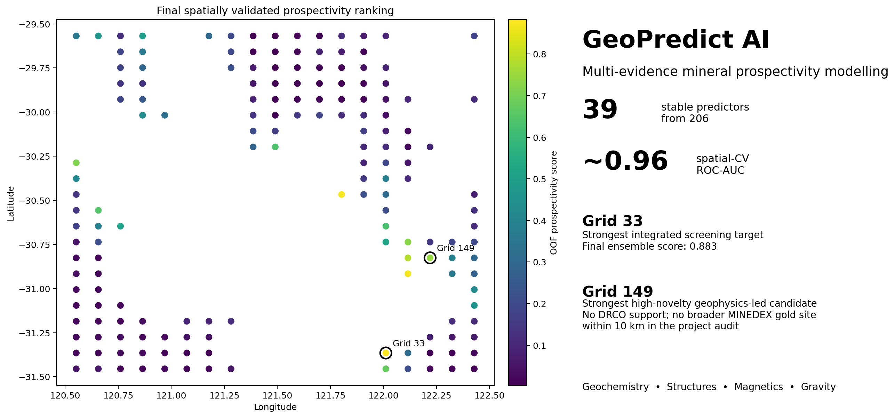
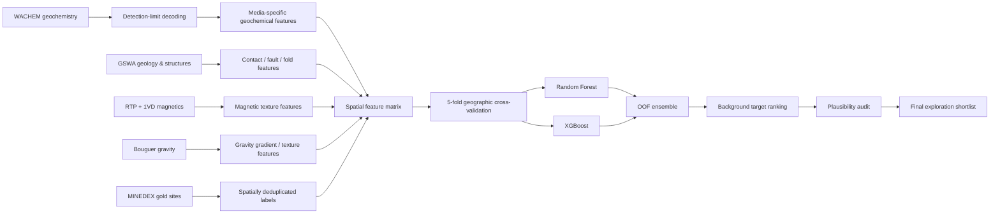

# GeoPredict AI

**Spatially validated multi-evidence gold prospectivity modelling for Western Australia's Eastern Goldfields.**



GeoPredict AI is an end-to-end geospatial machine-learning project integrating **geochemistry, structural geology, magnetic texture and Bouguer gravity** to rank regional gold prospectivity while explicitly testing for **historical exploration bias**.

> **Portfolio headline:** reduced a 206-predictor evidence stack to 39 fold-stable features and achieved ~0.96 ROC-AUC under five geographic cross-validation folds.
> 
**Tech:** Python · Scikit-learn · XGBoost · Spatial Cross-Validation · Geospatial ML · Feature Selection · Mineral Prospectivity Mapping

### Key results

| Result | Outcome |
|---|---:|
| Final compact feature set | **39 / 206 predictors** |
| Random Forest — 5-fold spatial-CV ROC-AUC | **0.960 ± 0.038** |
| XGBoost — 5-fold spatial-CV ROC-AUC | **0.960 ± 0.037** |
| RF/XGBoost ensemble ROC-AUC | **~0.962** |
| Ensemble PR-AUC | **~0.904** |
| Strongest integrated target | **Grid 33 — 0.883** |
| Strongest high-novelty candidate | **Grid 149 — 0.744** |

**Core technical contribution:** drill-core density initially improved predictive performance, but controlled ablation showed that much of the gain encoded historical exploration effort. Those drill-density predictors were therefore excluded from the final scientific model.

### What the project demonstrates

- spatial cross-validation rather than random train/test splitting;
- detection-limit-aware geochemical preprocessing;
- sample-media separation and leakage/bias diagnostics;
- multi-scale magnetic and gravity texture engineering;
- correlated-feature pruning and fold-stability selection;
- Random Forest/XGBoost comparison and OOF ensembling;
- explicit separation of **model score**, **geological plausibility**, and **exploration novelty**.

### Final outputs

| Output | Where to look |
|---|---|
| Technical case study | [`docs/CASE_STUDY.md`](docs/CASE_STUDY.md) |
| Methodology | [`docs/METHODOLOGY.md`](docs/METHODOLOGY.md) |
| Model limitations | [`docs/MODEL_CARD.md`](docs/MODEL_CARD.md) |
| Final target ranking | [`data/derived/final_background_ranking.csv`](data/derived/final_background_ranking.csv) |
| Final figures | [`reports/figures/`](reports/figures/) |
| Reproducible CV script | [`scripts/train_spatial_cv.py`](scripts/train_spatial_cv.py) |

## Why this project is different

A high-performing mineral-exploration model can be misleading if it learns the historical exploration footprint instead of geology. GeoPredict AI therefore treats exploration bias as a first-class modelling problem.

The workflow deliberately separates:

- surface geochemistry from drill-core information;
- strict deposit labels from broader prospects/mines/occurrences;
- independent geology from exploration-conditioned features;
- single-point geophysical values from local magnetic/gravity texture;
- model rank from exploration novelty.

## Methodology



## Evidence stack

| Evidence family | Examples |
|---|---|
| Geochemistry | Au, As, Sb, Ni, Te neighbourhood summaries and sample-density context |
| Structure | major fault/shear length, distance to contacts and folds |
| Magnetics | RTP plus 1VD medians, gradients and local variability |
| Gravity | Bouguer gravity gradients, ranges and local variability |

The final scientific model excludes drill-core density, even though it improved raw predictive performance, because ablation showed that it strongly encoded historical exploration effort.

## Model development highlights

### 1. Detection-limit-safe geochemistry

WACHEM negative analytical values were decoded as below-detection-limit measurements rather than treated as physical negative concentrations. The preprocessing retained censoring flags and used a documented first-pass numerical substitution.

### 2. Sample-media separation

Outcrop, unspecified media, and drill-core data were not blindly pooled. Outcrop geochemistry formed the primary regional surface layer; drill core was treated separately for bias diagnostics.

### 3. Spatial validation

All core model comparisons use the same five geographic holdout folds rather than random cross-validation.

### 4. Exploration-bias diagnosis

Adding drill-core features increased ROC-AUC, but drill-data availability/density alone reproduced much of the gain. The final scientific model therefore excludes that feature family.

### 5. Independent geology and geophysics

Mapped structures improved the geochemical baseline. Magnetic texture improved it further, and gravity texture produced another meaningful uplift.

### 6. Final reduction

The gravity-aware model contained 206 predictors. Correlated geophysical variables were pruned, then fold-stable predictors were selected, yielding a compact **39-feature model** that matched or exceeded the larger feature sets.

## Final model comparison

| Model | Features | Mean ROC-AUC | Mean PR-AUC |
|---|---:|---:|---:|
| Random Forest — full | 206 | 0.949 | 0.882 |
| Random Forest — correlation-pruned | 175 | 0.957 | 0.889 |
| **Random Forest — compact** | **39** | **0.960** | **0.898** |
| XGBoost — full | 206 | 0.942 | 0.876 |
| XGBoost — correlation-pruned | 175 | 0.957 | 0.896 |
| **XGBoost — compact** | **39** | **0.960** | **0.906** |

## Final target interpretation

Raw model rank is not the same as exploration novelty.

- **Grid 33** — strongest integrated target; structurally and geophysically supported, but historical drilling exists nearby.
- **Grid 149** — strongest high-novelty candidate; no drill-core support in the project footprint, no broader MINEDEX gold site within 10 km, and independently strengthened by magnetic and gravity texture.
- High-ranking cells near known prospects/mines are retained as **validation hits**, not presented as discoveries.

See [`docs/CASE_STUDY.md`](docs/CASE_STUDY.md) for the technical narrative and [`docs/MODEL_CARD.md`](docs/MODEL_CARD.md) for limitations.

## Repository structure

```text
GeoPredict-AI/
├── config/
│   └── model_config.yaml
├── data/
│   └── derived/
├── docs/
│   ├── CASE_STUDY.md
│   ├── DATA_DICTIONARY.md
│   ├── METHODOLOGY.md
│   └── MODEL_CARD.md
├── reports/
│   └── figures/
├── scripts/
│   ├── build_features.py
│   ├── train_spatial_cv.py
│   └── rank_targets.py
├── src/
│   └── geopredict/
│       ├── __init__.py
│       ├── evaluation.py
│       ├── feature_selection.py
│       └── targeting.py
├── tests/
│   └── test_targeting.py
├── .gitignore
├── requirements.txt
└── README.md
```

## Reproducibility

This portfolio repository contains code, documentation, model summaries, derived rankings, and figures. It intentionally does **not** redistribute the large source geoscience datasets.

To reproduce the complete workflow, obtain the relevant source datasets from the original WA government repositories, preprocess them according to the methodology documentation, and place project-specific inputs outside version control.

## Limitations

- Pseudo-absence cells are not proven barren.
- The study is regional and the current grid is approximately 10 km; it is not deposit-scale targeting.
- Feature selection and internal reporting use the same spatial folds, so the final performance estimate remains an internal spatial-CV result.
- A fully independent geographic district or second goldfield is the preferred next validation step.
- No output should be interpreted as an economic resource estimate or discovery claim.

## Portfolio summary

> Built a spatially validated mineral-prospectivity system integrating geochemistry, structural geology, magnetic texture and Bouguer gravity. Diagnosed and removed exploration-footprint leakage, reduced 206 predictors to 39 stable features, and achieved ~0.96 spatial-CV ROC-AUC while maintaining explicit uncertainty and novelty checks in target ranking.
