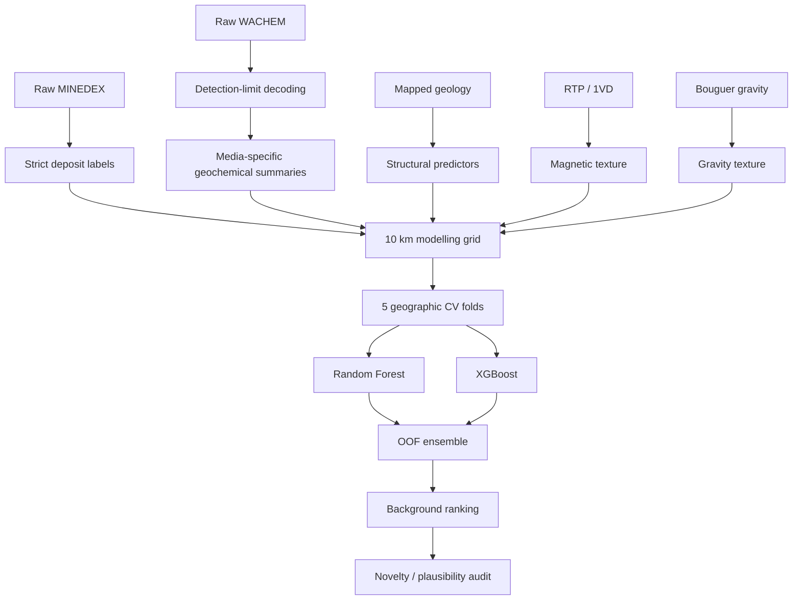

# Methodology

## Pipeline

## Validation rules

- Same geographic fold assignment for all core model comparisons.
- Imputation is fitted inside each training fold.
- Drill-core exploration-density features are excluded from the final scientific model.
- Pseudo-absence background is explicitly treated as uncertain rather than proven barren.

## Feature reduction

1. Build full gravity-aware stack.
2. Compute geophysical Spearman correlation matrix.
3. Greedily remove geophysical variables with |ρ| > 0.90, retaining the stronger member.
4. Train Random Forests across the five spatial folds.
5. Keep features repeatedly appearing among the most important predictors.
6. Retain the four pre-specified structural variables.
7. Compare full, correlation-pruned, and compact models under identical folds.

## Final score

The final out-of-fold prospectivity score is the mean of compact-model Random Forest and XGBoost OOF scores.

Model disagreement is retained as a simple uncertainty indicator.

## Targeting rule

Only strict-background cells are ranked. High model score does not automatically imply novelty; broader MINEDEX proximity and historical drill-core footprint are checked before a candidate is described as a follow-up target.
